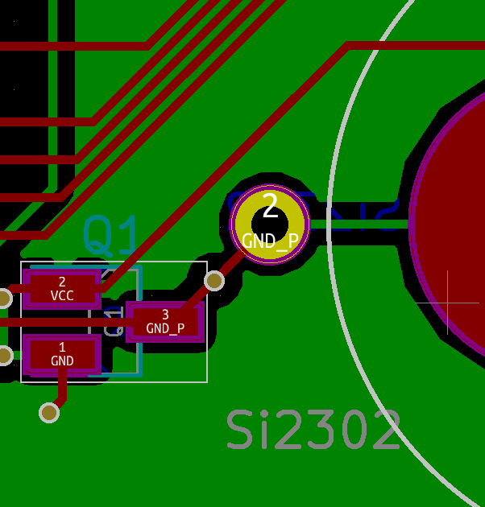
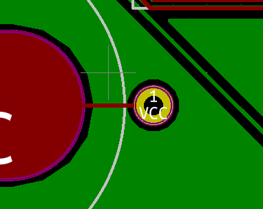

# orthrus
56 key wireless split keyboard running on QMK. Staggered orthogonal layout

Refer to individual folders for help on the build, raise an issue if you need any extra help :)

To use with qmk, just merge the qmk_firmware/ directory in this repository with your downloaded qmk_firmware directory

# UPDATES

Over the time that I have been using this keyboard, the "sandwich" style battery holder has bee less than ideal. I have modified my keyboard with [these battery holders](https://au.rs-online.com/web/p/battery-holders-mounts/7188457/), which are epoxied to the top PCB for each half. The negative terminal of the battery holder is soldered to pad 3 "GND_P" on the top PCB with a short wire:

The positive terminal is soldered to the through-hole VCC connection with a short wire:

This is what it looks like now.

# Acknowledgements
Thanks to [@reversebias](https://github.com/reversebias) for the inspiration as well as the firmware to make this work and [@joric](https://github.com/joric) for making the firmware work with the cheaper nrf modules

Thanks to technomancy for the original 42 key [atreus](https://atreus.technomancy.us) design and profet for the [atreus62](http://shop.profetkeyboards.com/product/atreus62-keyboard) design that I have been using for quite a while.
