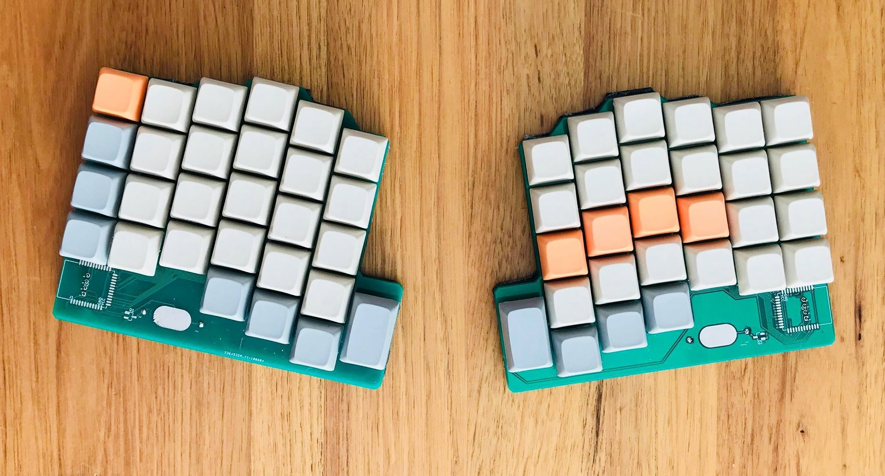

# orthrus
56 key wireless split keyboard running on QMK. Staggered orthogonal layout

Refer to individual folders for help on the build, raise an issue if you need any extra help :)

To use with qmk, just merge the qmk_firmware/ directory in this repository with your downloaded qmk_firmware directory

# Acknowledgements
Thanks to [@reversebias](https://github.com/reversebias) for the inspiration as well as the firmware to make this work and [@joric](https://github.com/joric) for making the firmware work with the cheaper nrf modules

Thanks to technomancy for the original 42 key [atreus](https://atreus.technomancy.us) design and profet for the [atreus62](http://shop.profetkeyboards.com/product/atreus62-keyboard) design that I have been using for quite a while.
